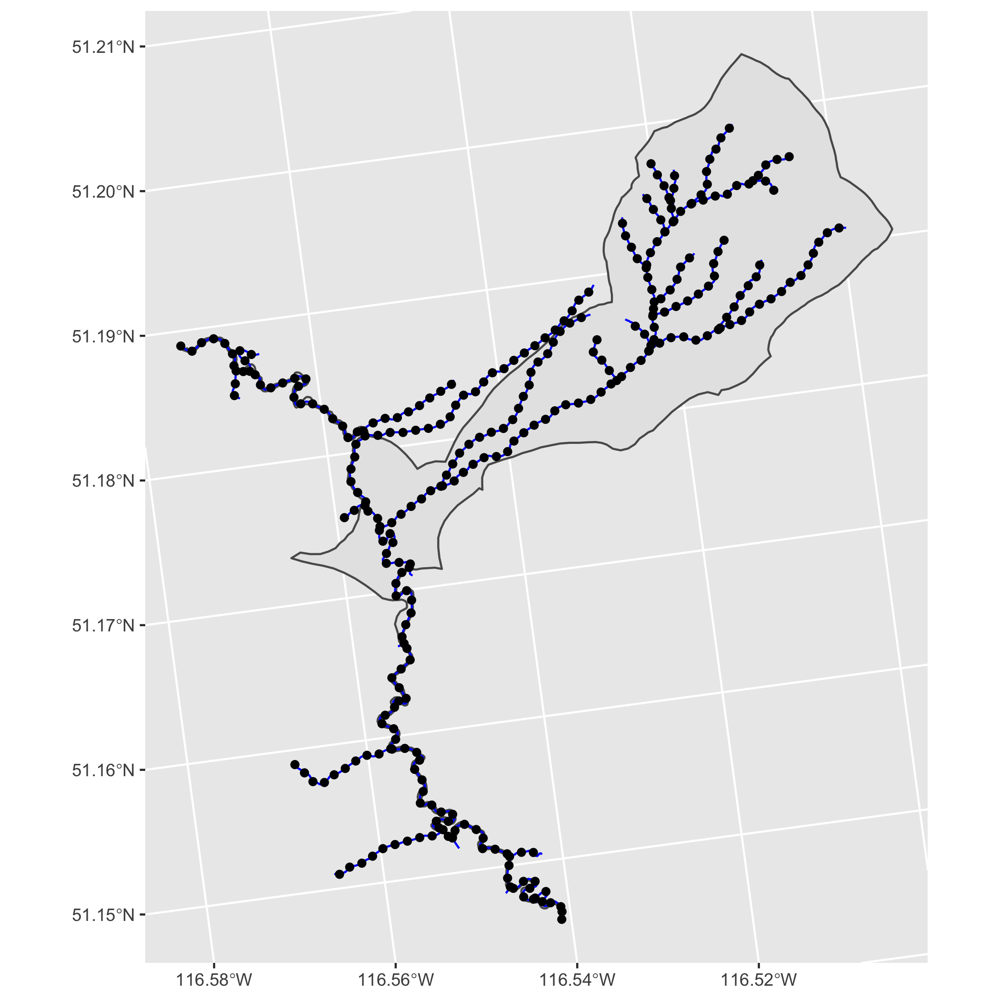

<!-- README.md is generated from README.Rmd. Please edit that file -->

# fwatlasbc 

<!-- badges: start -->

[](https://lifecycle.r-lib.org/articles/stages.html#experimental)
[](https://github.com/poissonconsulting/fwatlasbc/actions)
[](https://codecov.io/gh/poissonconsulting/fwatlasbc)
[](https://opensource.org/licenses/MIT)
<!-- badges: end -->

`fwatlasbc` is an R package for querying data from the [Freshwater
Atlas](https://www2.gov.bc.ca/gov/content/data/geographic-data-services/topographic-data/freshwater)
(FWA) of British Columbia. Spatial data are returned as [simple
features](https://github.com/r-spatial/sf).

`fwatlasbc` wraps
[`fwapgr`](https://github.com/poissonconsulting/fwapgr) an R package
that uses the [fwapg API](https://www.hillcrestgeo.ca/fwapg/index.html).

## Installation

You can install the latest version of `fwatlasbc` from
[GitHub](https://github.com/poissonconsulting/fwatlasbc) with:

``` r
# install.packages("devtools")
devtools::install_github("poissonconsulting/fwatlasbc")
```

## Demonstration

Find stream names using regular expression. There may be more than one
stream name that matches the regular expression.

``` r
library(fwatlasbc)
streams <- fwa_find_stream_names("steep c")
streams
#> # A tibble: 2 × 1
#>   stream_name       
#>   <chr>             
#> 1 Steep Canyon Creek
#> 2 Steep Creek
```

Add blue line keys (blk) to stream names. There may be multiple streams
with the same name.

``` r
blks <- fwa_add_blks_to_stream_name(streams)
blks
#> # A tibble: 4 × 2
#>   stream_name              blk
#>   <chr>                  <int>
#> 1 Steep Canyon Creek 360883036
#> 2 Steep Creek        356362258
#> 3 Steep Creek        356534225
#> 4 Steep Creek        356570155
blks <- blks[blks$blk == 356534225,]
```

Alternatively get the nearest blue line key and river meter (rm) from
the longitude and latitude. The river meter is the distance in meters as
the fish swims from the mouth of the river. The distance_to_lon_lat is
the how far the original point was from the stream in meters.

``` r
fwa_add_rm_to_lon_lat(data.frame(lon = -132.26, lat = 53.36))
#> Simple feature collection with 1 feature and 5 fields
#> Geometry type: POINT
#> Dimension:     XY
#> Bounding box:  xmin: 585153.6 ymin: 946162.9 xmax: 585153.6 ymax: 946162.9
#> Projected CRS: NAD83 / BC Albers
#> # A tibble: 1 × 6
#>     lon   lat       blk    rm distance_to_lon_lat            geometry
#>   <dbl> <dbl>     <int> <dbl>               <dbl>         <POINT [m]>
#> 1 -132.  53.4 360824839 1118.                508. (585153.6 946162.9)
```

Get watershed for a blue line key and river meter (by default 0). If it
errors try increasing the river meter.

``` r
wshed <- fwa_add_watershed_to_blk(blks)
wshed
#> Simple feature collection with 1 feature and 3 fields
#> Geometry type: POLYGON
#> Dimension:     XY
#> Bounding box:  xmin: 1656218 ymin: 725423.1 xmax: 1661726 ymax: 732146.2
#> Projected CRS: NAD83 / BC Albers
#> # A tibble: 1 × 4
#>   stream_name       blk    rm                                           geometry
#>   <chr>           <int> <dbl>                                      <POLYGON [m]>
#> 1 Steep Creek 356534225     0 ((1658037 728924.8, 1658107 728964.9, 1658107 728…
```

Get stream network for the watershed polygon. Note that rm is from the
original watershed while downstream/upstream_route_measure are the
equivalents for the stream segment in the network.

``` r
network <- fwa_add_collection_to_watershed(wshed, "stream_network")
network
#> Simple feature collection with 76 features and 31 fields
#> Geometry type: LINESTRING
#> Dimension:     XY
#> Bounding box:  xmin: 1656200 ymin: 725423.1 xmax: 1661368 ymax: 731602.7
#> Projected CRS: NAD83 / BC Albers
#> # A tibble: 76 × 32
#>    stream_name       blk    rm id        blue_line_key blue_line_key_50k
#>    <chr>           <int> <dbl> <chr>             <int>             <int>
#>  1 Steep Creek 356499676     0 707009047     356499676                NA
#>  2 Steep Creek 356407032     0 707009141     356407032                NA
#>  3 Steep Creek 356462244     0 707009211     356462244                NA
#>  4 Steep Creek 356494188     0 707009213     356494188                NA
#>  5 Steep Creek 356499676     0 707009233     356499676                NA
#>  6 Steep Creek 356397697     0 707009235     356397697                NA
#>  7 Steep Creek 356499676     0 707009415     356499676                NA
#>  8 Steep Creek 356494188     0 707009417     356494188                NA
#>  9 Steep Creek 356499676     0 707009460     356499676                NA
#> 10 Steep Creek 356499676     0 707009535     356499676                NA
#> # … with 66 more rows, and 26 more variables: downstream_route_measure <dbl>,
#> #   edge_type <int>, feature_code <chr>, feature_source <chr>,
#> #   fwa_watershed_code <chr>, gnis_id <int>, gnis_name <chr>, gradient <dbl>,
#> #   left_right_tributary <chr>, length_metre <dbl>, linear_feature_id <int>,
#> #   local_watershed_code <chr>, localcode_ltree <chr>, stream_magnitude <int>,
#> #   stream_order <int>, upstream_area_ha <chr>, upstream_route_measure <dbl>,
#> #   waterbody_key <int>, watershed_code_50k <chr>, …
```

Convert the stream network into a table blue line keys with regularly
spaced river meters starting at 0.

``` r
rms <- fwa_convert_stream_network_to_rms(network, interval = 100)
rms
#> Simple feature collection with 544 features and 33 fields
#> Geometry type: POINT
#> Dimension:     XY
#> Bounding box:  xmin: 1656200 ymin: 725425.2 xmax: 1661313 ymax: 731570.9
#> Projected CRS: NAD83 / BC Albers
#> # A tibble: 544 × 34
#>    id              blk    rm stream_name parent_blk parent_rm blue_line_key
#>    <chr>         <int> <int> <chr>            <int>     <dbl>         <int>
#>  1 707017402 356365061     0 Steep Creek         NA       NA      356365061
#>  2 707017293 356369408     0 Steep Creek         NA       NA      356369408
#>  3 707009537 356372687     0 Steep Creek  356499676      998.     356372687
#>  4 707009537 356372687   100 Steep Creek  356499676      998.     356372687
#>  5 707009537 356372687   200 Steep Creek  356499676      998.     356372687
#>  6 707009537 356372687   300 Steep Creek  356499676      998.     356372687
#>  7 707012416 356391879     0 Steep Creek  356534225      587.     356391879
#>  8 707012416 356391879   100 Steep Creek  356534225      587.     356391879
#>  9 707012416 356391879   200 Steep Creek  356534225      587.     356391879
#> 10 707012416 356391879   300 Steep Creek  356534225      587.     356391879
#> # … with 534 more rows, and 27 more variables: blue_line_key_50k <int>,
#> #   downstream_route_measure <dbl>, edge_type <int>, feature_code <chr>,
#> #   feature_source <chr>, fwa_watershed_code <chr>, gnis_id <int>,
#> #   gnis_name <chr>, gradient <dbl>, left_right_tributary <chr>,
#> #   length_metre <dbl>, linear_feature_id <int>, local_watershed_code <chr>,
#> #   localcode_ltree <chr>, stream_magnitude <int>, stream_order <int>,
#> #   upstream_area_ha <chr>, upstream_route_measure <dbl>, …
```

Plot the watershed, network and river meters.

``` r
ggplot2::ggplot() +
  ggplot2::geom_sf(data = wshed) +
  ggplot2::geom_sf(data = network, color = "blue") +
  ggplot2::geom_sf(data = rms)
```



## Inspiration

`fwatlasbc` supersedes the archived
[`fwabc`](https://github.com/poissonconsulting/fwabc) which retrieved
data via
[WFS](https://openmaps.gov.bc.ca/geo/pub/wfs?service=WFS&version=2.0.0&request=GetFeature&typeName=WHSE_BASEMAPPING.FWA_LAKES_POLY&outputFormat=json&SRSNAME=epsg%3A3005&CQL_FILTER=GNIS_NAME_1=%27Quamichan%20Lake%27)
using [`bcdata`](https://github.com/bcgov/bcdata).

## Creditation

`fwatlasbc` relies on [fwapg
API](https://www.hillcrestgeo.ca/fwapg/index.html) which is created,
maintained and hosted by [Simon
Norris](https://github.com/smnorris/fwapg) at [Hillcrest
Geographics](https://hillcrestgeo.ca/main/).

## Contribution

Please report any
[issues](https://github.com/poissonconsulting/fwatlasbc/issues).

[Pull requests](https://github.com/poissonconsulting/fwatlasbc/pulls)
are always welcome.

### Code of Conduct

Please note that `fwatlasbc` is released with a [Contributor Code of
Conduct](https://contributor-covenant.org/version/2/0/CODE_OF_CONDUCT.html).
By contributing to this project, you agree to abide by its terms.
