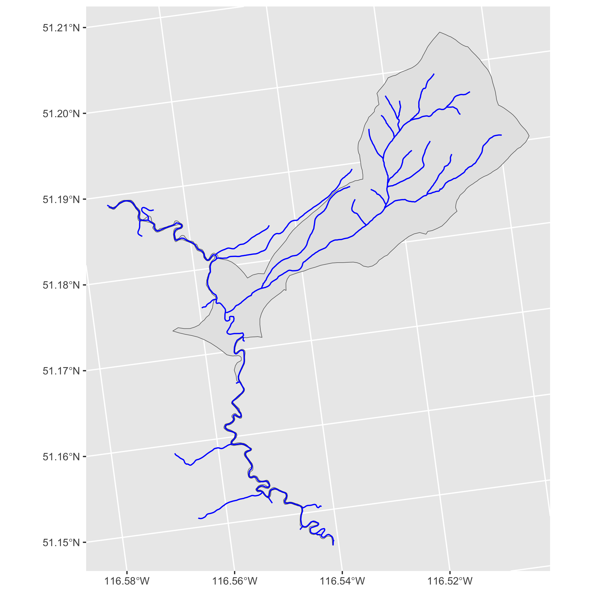

<!-- README.md is generated from README.Rmd. Please edit that file -->

# fwatlasbc 

<!-- badges: start -->

[](https://lifecycle.r-lib.org/articles/stages.html#experimental)
[](https://github.com/poissonconsulting/fwatlasbc/actions/workflows/R-CMD-check.yaml)
[](https://codecov.io/gh/poissonconsulting/fwatlasbc)
[](https://opensource.org/licenses/MIT)
<!-- badges: end -->

`fwatlasbc` is an R package for querying data from the [Freshwater
Atlas](https://www2.gov.bc.ca/gov/content/data/geographic-data-services/topographic-data/freshwater)
(FWA) of British Columbia. Spatial data are returned as [simple
features](https://github.com/r-spatial/sf).

`fwatlasbc` wraps
[`fwapgr`](https://github.com/poissonconsulting/fwapgr) an R package
that uses the [fwapg API](https://www.hillcrestgeo.ca/fwapg/index.html).

## Installation

You can install the latest version of `fwatlasbc` from
[GitHub](https://github.com/poissonconsulting/fwatlasbc) with:

``` r
# install.packages("devtools")
devtools::install_github("poissonconsulting/fwatlasbc")
```

## Demonstration

Find stream names using regular expression. There may be more than one
stream name that matches the regular expression.

``` r
library(fwatlasbc)
streams <- fwa_find_stream_names("steep c")
streams
#> # A tibble: 2 × 1
#>   stream_name       
#>   <chr>             
#> 1 Steep Canyon Creek
#> 2 Steep Creek
```

Add blue line keys (blk) to stream names. There may be multiple streams
with the same name.

``` r
blks <- fwa_add_blks_to_stream_name(streams)
blks
#> # A tibble: 4 × 2
#>   stream_name              blk
#>   <chr>                  <int>
#> 1 Steep Canyon Creek 360883036
#> 2 Steep Creek        356362258
#> 3 Steep Creek        356534225
#> 4 Steep Creek        356570155
blks <- blks[blks$blk == 356534225,]
```

Alternatively get the nearest blue line key and river meter (rm) from
the longitude and latitude. The river meter is the distance in meters as
the fish swims from the mouth of the river. The distance_to_lon_lat is
the how far the original point was from the stream in meters.

``` r
fwa_add_blk_to_lon_lat(data.frame(lon = -132.26, lat = 53.36))
#> Simple feature collection with 1 feature and 5 fields
#> Geometry type: POINT
#> Dimension:     XY
#> Bounding box:  xmin: 585153.6 ymin: 946162.9 xmax: 585153.6 ymax: 946162.9
#> Projected CRS: NAD83 / BC Albers
#> # A tibble: 1 × 6
#>     lon   lat       blk    rm distance_to_lon_lat            geometry
#>   <dbl> <dbl>     <dbl> <dbl>               <dbl>         <POINT [m]>
#> 1 -132.  53.4 360824839 1118.                508. (585153.6 946162.9)
```

Get watershed (by aggregating fundamental watersheds) for a blue line
key and river meter (by default 0). If it errors try increasing the
river meter.

``` r
wshed <- fwa_add_watershed_to_blk(blks)
wshed
#> Simple feature collection with 1 feature and 3 fields
#> Geometry type: POLYGON
#> Dimension:     XY
#> Bounding box:  xmin: 1656218 ymin: 725423.1 xmax: 1661726 ymax: 732146.2
#> Projected CRS: NAD83 / BC Albers
#> # A tibble: 1 × 4
#>   stream_name       blk    rm                                           geometry
#>   <chr>           <int> <dbl>                                      <POLYGON [m]>
#> 1 Steep Creek 356534225     0 ((1658107 728964.9, 1658107 728964.9, 1658179 728…
```

Get stream network for the watershed polygon. Note that rm is from the
original watershed while downstream/upstream_route_measure are the
equivalents for the stream segment in the network.

``` r
network <- fwa_add_collection_to_polygon(wshed, "stream_network")
network
#> Simple feature collection with 76 features and 31 fields
#> Geometry type: LINESTRING
#> Dimension:     XY
#> Bounding box:  xmin: 1656200 ymin: 725423.1 xmax: 1661368 ymax: 731602.7
#> Projected CRS: NAD83 / BC Albers
#> # A tibble: 76 × 32
#>    stream…¹    blk    rm blue_…² blue_…³ downs…⁴ edge_…⁵ featu…⁶ featu…⁷ fwa_w…⁸
#>    <chr>     <dbl> <dbl>   <dbl>   <dbl>   <dbl>   <dbl> <chr>   <chr>   <chr>  
#>  1 Steep C… 3.57e8     0  3.57e8    1130  2931.     1250 WA2411… areal … 300-90…
#>  2 Steep C… 3.56e8     0  3.56e8      NA  1110.     1000 GA2485… linear… 300-90…
#>  3 Steep C… 3.57e8     0  3.57e8      NA     0      1000 GA2485… linear… 300-90…
#>  4 Steep C… 3.57e8     0  3.57e8    1142  2594.     1000 GA2485… linear… 300-90…
#>  5 Steep C… 3.57e8     0  3.57e8    1142  2251.     1000 GA2485… linear… 300-90…
#>  6 Steep C… 3.56e8     0  3.56e8      NA     0      1000 GA2485… linear… 300-90…
#>  7 Steep C… 3.56e8     0  3.56e8      NA     0      1000 GA2485… linear… 300-90…
#>  8 Steep C… 3.57e8     0  3.57e8    1131    51.8    1000 GA2485… linear… 300-90…
#>  9 Steep C… 3.57e8     0  3.57e8    1130   751.     1250 WA2411… areal … 300-90…
#> 10 Steep C… 3.56e8     0  3.56e8      NA   346.     1000 GA2485… linear… 300-90…
#> # … with 66 more rows, 22 more variables: gnis_id <dbl>, gnis_name <chr>,
#> #   gradient <dbl>, left_right_tributary <chr>, length_metre <dbl>,
#> #   linear_feature_id <dbl>, local_watershed_code <chr>, localcode_ltree <chr>,
#> #   stream_magnitude <dbl>, stream_order <dbl>, stream_order_max <dbl>,
#> #   stream_order_parent <dbl>, upstream_route_measure <dbl>,
#> #   waterbody_key <dbl>, watershed_code_50k <chr>, watershed_group_code <chr>,
#> #   watershed_group_code_50k <chr>, watershed_group_id <dbl>, …
```

Convert the stream network into a table of blue line keys with regularly
spaced river meters starting at 0.

``` r
#rms <- fwa_convert_stream_network_to_rms(network, interval = 100)
#rms
```

Plot the watershed, network and river meters.

``` r
ggplot2::ggplot() +
  ggplot2::geom_sf(data = wshed) +
  ggplot2::geom_sf(data = network, color = "blue") +
#  ggplot2::geom_sf(data = rms) +
  NULL
```



## Inspiration

`fwatlasbc` supersedes the archived
[`fwabc`](https://github.com/poissonconsulting/fwabc) which retrieved
data via
[WFS](https://openmaps.gov.bc.ca/geo/pub/wfs?service=WFS&version=2.0.0&request=GetFeature&typeName=WHSE_BASEMAPPING.FWA_LAKES_POLY&outputFormat=json&SRSNAME=epsg%3A3005&CQL_FILTER=GNIS_NAME_1=%27Quamichan%20Lake%27)
using [`bcdata`](https://github.com/bcgov/bcdata).

## Creditation

`fwatlasbc` relies on [fwapg
API](https://www.hillcrestgeo.ca/fwapg/index.html) which is created,
maintained and hosted by [Simon
Norris](https://github.com/smnorris/fwapg) at [Hillcrest
Geographics](https://hillcrestgeo.ca/main/).

## Contribution

Please report any
[issues](https://github.com/poissonconsulting/fwatlasbc/issues).

[Pull requests](https://github.com/poissonconsulting/fwatlasbc/pulls)
are always welcome.

### Code of Conduct

Please note that `fwatlasbc` is released with a [Contributor Code of
Conduct](https://contributor-covenant.org/version/2/0/CODE_OF_CONDUCT.html).
By contributing to this project, you agree to abide by its terms.
